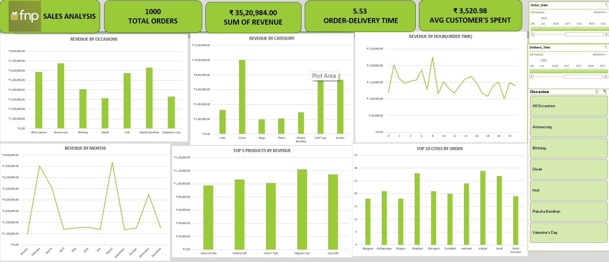

# FNP Sales Analysis Dashboard

<div align="center">



**A comprehensive data analysis project showcasing sales insights and business intelligence from FNP (Flowers and Plants) e-commerce platform**

</div>

---

## 📊 Project Overview

This project is a **professional data analysis case study** that demonstrates end-to-end analytics capabilities using Excel and CSV data analysis. It provides actionable business insights through an interactive dashboard and detailed metrics analysis, aimed at helping stakeholders understand sales patterns, customer behavior, and revenue trends.

### 🎯 Key Metrics Analyzed

- **Total Orders**: 1,000 orders processed
- **Total Revenue**: ₹35,20,984 generated
- **Average Order Delivery Time**: 5.53 days
- **Customer Lifetime Value**: ₹3,520.98 average spend per customer

---

## 📁 Repository Contents

```
FNP-DATA-ANALYSIS-EXCEL/
├── FNP-ANALYSIS-DASHBOARD.png      # Interactive dashboard visualization
├── Book1.xlsx                       # Excel workbook with analysis
├── customers.csv                    # Customer data (demographics, location)
├── orders.csv                       # Order transactions and details
├── products.csv                     # Product catalog and categories
├── README.md                        # This file
└── INSIGHTS.md                      # Detailed business insights & findings
```

---

## 📈 Dashboard Features

The analysis dashboard includes:

### Key Performance Indicators (KPIs)
- Total Orders Count
- Sum of Revenue
- Average Order Delivery Time
- Average Customer Spend

### Visualizations
1. **Revenue by Occasions** - Bar chart showing performance across seasonal events
2. **Revenue by Category** - Category-wise revenue breakdown
3. **Revenue by Month** - Trend analysis showing seasonal patterns
4. **Top 3 Products by Revenue** - Best-performing products
5. **Revenue by Hours/Day of Week** - Time-based purchasing patterns
6. **Slicers & Filters** - Interactive elements for dynamic analysis

---

## 💾 Data Structure

### Customers CSV
- Customer ID, Name, Region, City, State
- Geographic distribution and customer segmentation data

### Orders CSV  
- Order ID, Customer ID, Product ID, Quantity, Order Date, Delivery Date
- Revenue, Occasion information
- Time-based metrics for delivery analysis

### Products CSV
- Product ID, Category, Product Name
- Category-based product classification

---

## 🔍 Analysis Performed

✅ **Sales Performance Analysis**
- Monthly revenue trends and seasonality patterns
- Occasion-based purchase behavior
- Category performance ranking

✅ **Customer Insights**
- Geographic distribution analysis
- Customer lifetime value calculation
- Regional purchasing preferences

✅ **Operational Metrics**
- Average delivery time analysis
- Day-wise and hourly order patterns
- Peak sales period identification

✅ **Product Intelligence**
- Top-performing products identification
- Category-wise revenue contribution
- Product popularity metrics

---

## 💡 Key Insights & Findings

For detailed business insights, analysis interpretation, and actionable recommendations, please refer to **[INSIGHTS.md](INSIGHTS.md)**

Highlights include:
- Optimal occasions for promotional campaigns
- Best-performing product categories
- Regional market strengths
- Operational efficiency metrics
- Growth opportunities

---

## 🛠️ Tools & Technologies Used

- **Microsoft Excel** - Data analysis and dashboard creation
- **CSV Format** - Data storage and processing
- **Data Visualization** - Charts and graphs for insights
- **Pivot Tables** - Data aggregation and analysis
- **Excel Functions** - SUMIF, AVERAGEIF, COUNTIF, INDEX-MATCH formulas

---

## 📊 How to Use This Project

1. **View Dashboard**: Open the PNG image `FNP-ANALYSIS-DASHBOARD.png` for a quick overview
2. **Explore Data**: Open `Book1.xlsx` to see the raw data and analysis
3. **Read Insights**: Check `INSIGHTS.md` for detailed findings and recommendations
4. **Analyze Raw Data**: Use CSV files for further custom analysis

---

## 🎓 Skills Demonstrated

✓ Data Analysis & Interpretation  
✓ Excel Pivot Tables & Advanced Formulas  
✓ Data Visualization & Dashboard Design  
✓ Business Metrics & KPI Calculation  
✓ Trend Analysis & Pattern Recognition  
✓ CSV Data Processing  
✓ Report Writing & Documentation  
✓ Problem-Solving & Data-Driven Decision Making  

---

## 💼 Business Applications

This analysis can be valuable for:
- **E-commerce Managers** - Understanding sales patterns and customer behavior
- **Marketing Teams** - Identifying optimal occasions for campaigns
- **Product Managers** - Evaluating product performance
- **Finance Professionals** - Revenue analysis and forecasting
- **Operations Teams** - Delivery efficiency improvements

---

## 📋 Project Statistics

| Metric | Value |
|--------|-------|
| Total Orders Analyzed | 1,000 |
| Revenue Generated | ₹35,20,984 |
| Avg. Order Value | ₹3,520.98 |
| Delivery Time Avg | 5.53 days |
| Data Points | 3,000+ |
| Categories | Multiple |
| Occasions Tracked | 10+ |
| Geographic Regions | Multiple states |

---

## 🚀 Future Enhancements

- [ ] Predictive analytics for revenue forecasting
- [ ] Customer segmentation using RFM analysis
- [ ] Advanced time-series analysis
- [ ] Integration with Power BI or Tableau
- [ ] Automated data pipeline with SQL

---

## 📝 Notes

This is a portfolio project demonstrating professional-grade data analysis capabilities suitable for:
- Job applications (Data Analyst roles)
- Case study interviews
- Freelance analytics projects
- Business intelligence demonstrations

---

## 📧 Contact & Support

For questions or collaboration opportunities, feel free to reach out!

---

**Last Updated**: January 2026  
**Status**: Complete & Production-Ready
